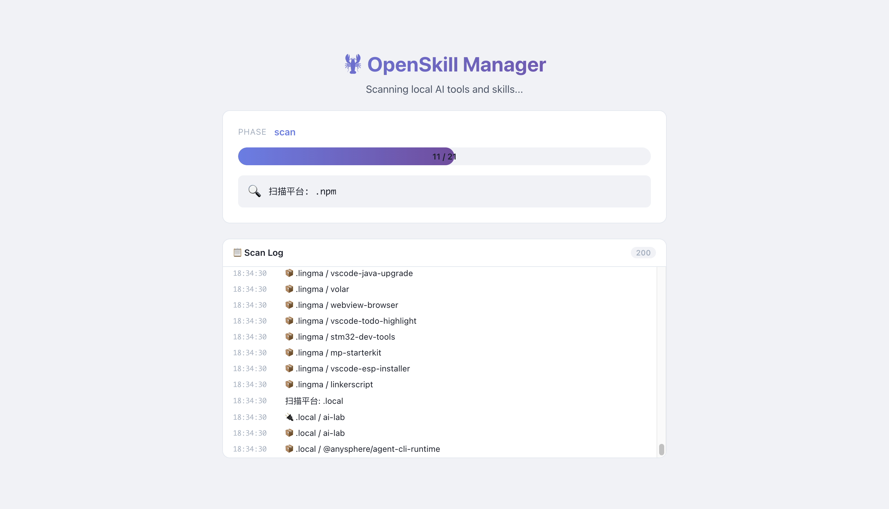

# OpenSkill Manager

A unified desktop dashboard designed for OpenClaw and 35+ other AI tool platforms to discover, manage, migrate, and package skills, plugins, and extensions seamlessly across frameworks.

<p align="center">
  <strong>Built with Electron + React + TypeScript</strong>
</p>

<!-- SCREENSHOT START -->
<p align="center">
  
</p>
<!-- SCREENSHOT END -->

---

## ✨ Features

### 🔍 Auto-Discovery Engine
Automatically scans your home directory for all installed AI tools and their skills. Recognizes 35+ platforms by name and intelligently discovers skill/plugin/extension directories using configurable path patterns.

### 🏷️ Unified Management
Skills, plugins, and extensions from different platforms are presented in a single, filterable view. Switch between types via tabs, filter by category or platform, and search by name/description.

### 📦 Batch Operations
Select multiple items using `Cmd/Ctrl+Click`, then:
- **Batch Migrate** — move skills across platforms in one action
- **Batch Export** — package selected items into a ZIP archive
- **Batch Delete** — remove multiple items with confirmation

### 📥 Import & Export
- **Export to ZIP** — package any selection of skills into a shareable `.zip` file
- **Import from ZIP** — unpack a skill package into any target platform
- **Import from Directory** — add a custom directory as a skill source

### 🔄 Cross-Platform Migration
Move skills between AI platforms with a single click. The app handles path resolution and re-registration automatically.

### 🌍 24 Languages
Full i18n support with 24 locales including English, Chinese (Simplified & Traditional), Japanese, Korean, Arabic, and more. RTL layouts are supported.

### 🎨 Auto-Category Classification
Skills are automatically categorized (Coding, Writing, Data, Creative, DevOps, etc.) based on metadata keywords, with manual category filtering in the sidebar.

### 📂 Real-Time Watch
File system changes (add/delete/modify) in skill directories are detected in real-time via `chokidar`, keeping the UI in sync without manual rescans.

---

## 🤖 Supported Platforms

The app auto-discovers any dot-directory in `~/` that matches a known AI tool. Currently recognized platforms:

| Platform | Config Directory | Type |
|----------|-----------------|------|
| Claude | `~/.claude` | AI Assistant |
| Cursor | `~/.cursor` | AI Code Editor |
| GitHub Copilot | `~/.copilot` | AI Pair Programmer |
| VS Code | `~/.vscode` | Code Editor |
| OpenClaw | `~/.openclaw` | AI Agent Framework |
| QClaw | `~/.qclaw` | AI Agent Platform |
| Trae | `~/.trae` | AI IDE |
| Cline | `~/.cline` | AI Coding Agent |
| CodeBuddy | `~/.codebuddy` | AI Code Assistant |
| Kode | `~/.kode` | AI IDE |
| Qoder | `~/.qoder` | AI Coder |
| Qwen | `~/.qwen` | AI Assistant |
| Ollama | `~/.ollama` | LLM Runtime |
| Gemini | `~/.gemini` | AI Assistant |
| ChatGPT | `~/.chatgpt` | AI Assistant |
| ... | | |

> **35 platforms** are pre-registered. Any unrecognized dot-directory with skill-like subdirectories will also be discovered automatically.

### Skill Directory Patterns

The scanner looks for subdirectories named:

```
skills/  plugins/  extensions/  addons/  modules/
packages/ .skills/ .plugins/ .extensions/
```

---

## 📸 Screenshots

> _Screenshots coming soon_

---

## 🚀 Getting Started

### Prerequisites

- **Node.js** ≥ 18
- **npm** ≥ 9

### Install

```bash
git clone https://github.com/your-username/openskill-manager.git
cd openskill-manager
npm install
```

### Development

```bash
# Start Electron + React in dev mode with hot reload
npm run dev
```

This runs two processes concurrently:
- **Webpack Dev Server** — React UI on `localhost:3000`
- **Electron Main Process** — watches and recompiles on changes

### Production Build

```bash
# Build webpack bundles
npm run build

# Package as distributable (DMG/ZIP on macOS, EXE on Windows, AppImage/DEB on Linux)
npm run dist
```

Output goes to `dist/`.

---

## 🏗️ Project Structure

```
openskill-manager/
├── src/
│   ├── electron/
│   │   ├── main.js            # Electron main process — discovery engine, IPC handlers, DB
│   │   └── preload.js         # Preload script — exposes electronAPI to renderer
│   └── react/
│       ├── components/
│       │   ├── App.tsx         # Root component — state management, routing
│       │   ├── Sidebar.tsx     # Platform list + category filter
│       │   ├── SkillGrid.tsx   # Card grid with multi-select support
│       │   ├── SkillDetail.tsx # Skill/plugin/extension detail panel
│       │   ├── PlatformDetail.tsx # Platform overview panel
│       │   ├── PlatformFilter.tsx # Platform icon bar
│       │   ├── PlatformIcon.tsx   # Platform icon with fallback
│       │   ├── CategoryFilter.tsx # Auto-category definitions & filter
│       │   ├── SkillList.tsx   # List view variant
│       │   ├── MigrateModal.tsx    # Migration dialog (single + batch)
│       │   ├── ImportModal.tsx     # ZIP import dialog
│       │   ├── AddDirectoryModal.tsx # Custom directory dialog
│       │   └── LanguageSelector.tsx  # 24-locale language picker
│       ├── i18n/
│       │   └── locales.ts     # All 24 locales + type definitions
│       ├── styles/
│       │   └── App.css        # Global styles + CSS variables (dark theme)
│       └── index.tsx          # React entry point
├── assets/                    # App icons and static assets
├── dist/                      # Build output
├── package.json
├── tsconfig.json
├── webpack.react.config.js    # React webpack config
├── webpack.electron.config.js # Electron webpack config
└── .babelrc
```

---

## 🔧 How It Works

### Discovery Engine

1. **Platform Discovery** — scans `~/` for dot-directories matching known AI tool names or containing skill-like subdirectories
2. **Skill Scanning** — for each platform, enumerates skill/plugin/extension directories and reads metadata from `SKILL.md` and `package.json`
3. **Storage** — discovered items are persisted in a local JSON database (`openskill.db`)

### Metadata Extraction

Each skill's metadata is resolved from two sources:

| Field | `SKILL.md` | `package.json` |
|-------|-----------|----------------|
| Name | `# Title` heading | `name` field |
| Description | `Description:` block | `description` field |
| Version | — | `version` field |
| Author | — | `author` (string or `{name, url}`) |
| License | — | `license` (string or `{type}`) |
| Categories | `Categories:` comma-separated | `categories` array |
| Keywords | — | `keywords` array |

> Complex object fields (e.g., `author: {name, url}`) are automatically flattened to strings.

### IPC Communication

The renderer communicates with the main process via these IPC channels:

| Channel | Direction | Description |
|---------|-----------|-------------|
| `scan-all` | → main | Trigger full rescan |
| `get-skills` | → main | Fetch all skills from DB |
| `add-custom-path` | → main | Register a custom directory |
| `migrate-skill` | → main | Move a skill to another platform |
| `delete-skill` | → main | Remove a skill record |
| `export-skills` | → main | Package skills into ZIP |
| `import-skills-from-file` | → main | Import skills from ZIP |
| `select-import-file` | → main | Open file picker dialog |
| `select-directory` | → main | Open directory picker |
| `open-in-finder` | → main | Reveal path in system file manager |
| `scan-progress` | main → | Progress events during scan |

---

## 🛠️ Tech Stack

| Layer | Technology |
|-------|-----------|
| Shell | Electron 28 |
| UI | React 18 |
| Language | TypeScript |
| Build | Webpack 5 + Babel |
| Package | electron-builder |
| File Watch | chokidar |
| Archive | archiver (export), adm-zip (import) |
| Storage | JSON file (local DB) |
| i18n | Custom — 24 locales |

---

## ⚙️ Configuration

### Build Targets

The app can be packaged for all major platforms:

```json
{
  "mac":   { "target": ["dmg", "zip"] },
  "win":   { "target": ["nsis", "portable"] },
  "linux": { "target": ["AppImage", "deb", "rpm"] }
}
```

### Custom Platform Registration

Add new platforms to the `KNOWN_PLATFORMS` array in `src/electron/main.js`:

```javascript
const KNOWN_PLATFORMS = [
  'claude', 'cursor', 'copilot', 'openclaw', 'qclaw',
  // Add your custom platform here
  'my-custom-ai-tool'
];
```

---

## 📋 Roadmap

- [x] Auto-discovery of AI tool platforms
- [x] Skill/plugin/extension scanning and display
- [x] Multi-select with batch operations
- [x] Cross-platform migration
- [x] ZIP import & export
- [x] 24-language i18n
- [x] Auto-category classification
- [x] Real-time file watching
- [ ] Skill enable/disable toggle
- [ ] Skill configuration editor
- [ ] Light/dark theme toggle
- [ ] Auto-update support
- [ ] Plugin marketplace integration
- [ ] Drag-and-drop migration

---

## 📄 License

MIT License — see [LICENSE](LICENSE) for details.

---

<p align="center">
  Built with ❤️ by <strong>Bo</strong> · Since 2026-05-13
</p>
